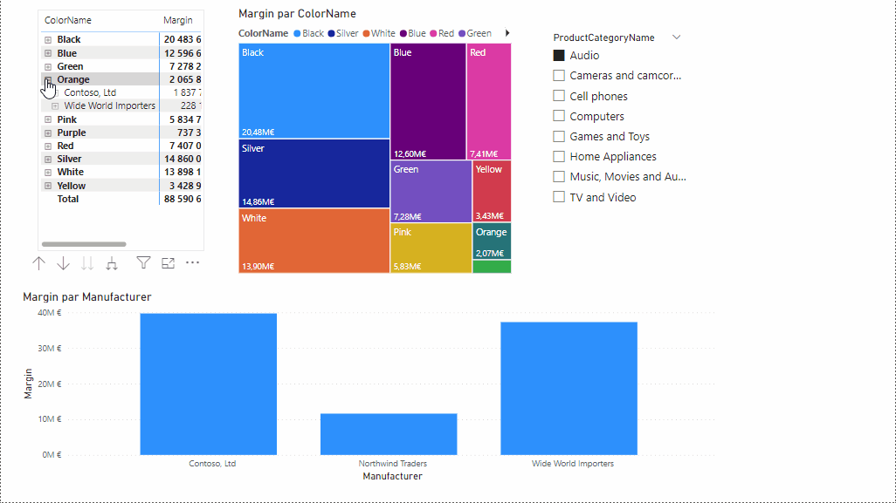

# PROJET CONTOSO :chart_with_upwards_trend:
## Table des matières
- [Introduction](#introduction)
- [Modèle Tabulaire](#Modèle-tabulaire)
- [EXCEL](#EXCEL)
- [PBI](#PBI)
- [Conclusion](#Conclusion)

## Introduction

Ceci est un projet d'analyse de donné avec SSAS , EXCEL et PBI basé sur la base de donnée Contoso 

Lien vers contoso databae :dvd: [Lien](https://www.microsoft.com/en-us/download/details.aspx?id=18279)

### Modèle tabulaire 

## Excel 

### Pivot Table EXCEL 

### Histogramme Groupés EXCEL :bar_chart:

## PBI
### Visuelle 1 PBI

### Visuelle 2 PBI

### Animation 

## Conclusion
Conclusion et prochaine étape

