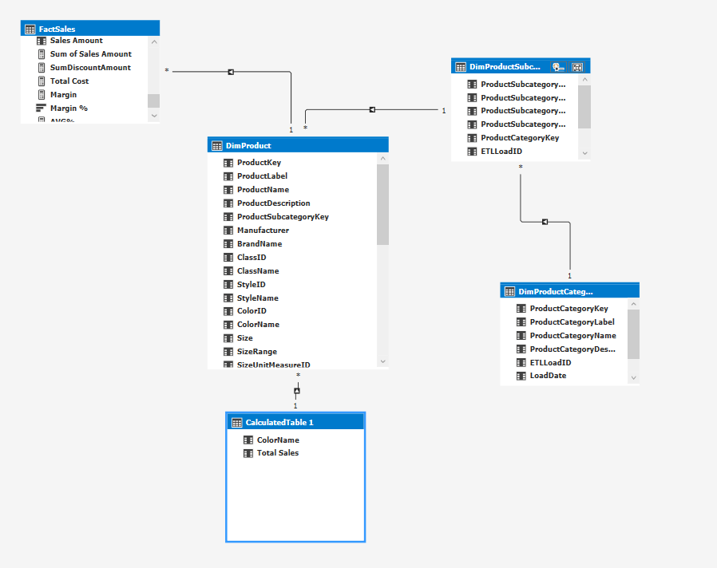
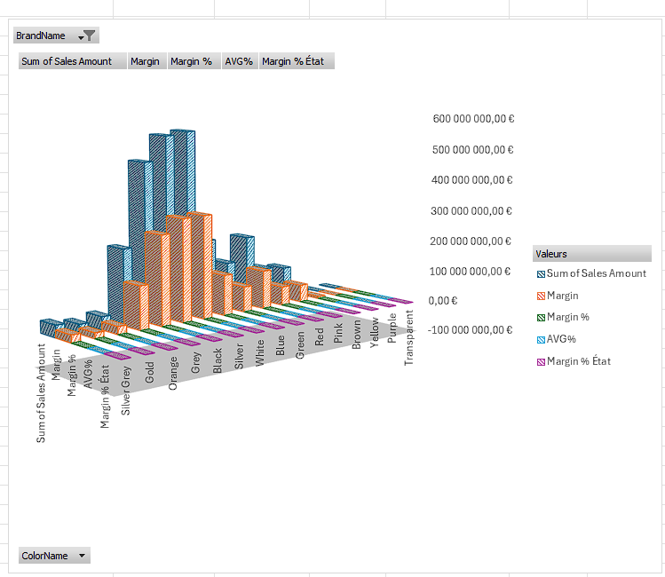
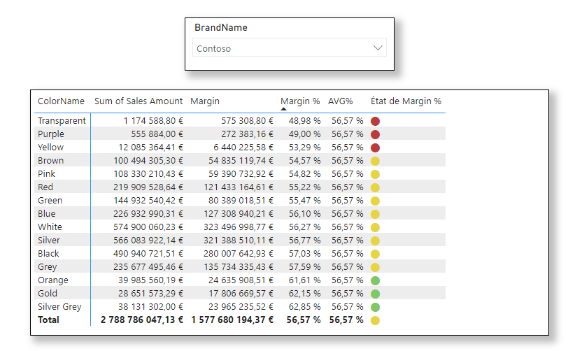

# PROJET CONTOSO 
## Table des matières
- [Introduction](#introduction)
- [Modèle Tabulaire](#Modèle-tabulaire)
- [EXCEL](#EXCEL)
- [PBI](#PBI)
- [Conclusion](#Conclusion)

## Introduction

Ceci est un projet d'analyse de donné basé sur la base de donnée Contoso 

### Modèle tabulaire 

## Excel 

### Pivot Table EXCEL

### Histogramme Groupés EXCEL

## PBI
### Visuelle 1 PBI

### Visuelle 2 PBI

## Conclusion
Conclusion et prochaine étape

